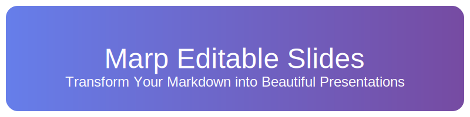

<p align="center">
  
</p>

# 🎯 Marp編集可能スライドサンプル

このリポジトリは、[Marp](https://marp.app/)を使用して編集可能なスライドを作成するためのミニマルなサンプルプロジェクトです。

## 🚀 特徴

- マークダウンでスライド作成
- リアルタイムプレビュー
- リッチエディタ機能
- PowerPointで編集可能な出力
- PDF出力対応
- プレゼンターノート対応
- リアルタイムコラボレーション
- テーマカスタマイズ

## 📁 リポジトリ構造

```plaintext
marp-editable-ui/
├─ client/               # フロントエンド（React + TypeScript）
│  ├─ src/
│  │  ├─ components/    # UIコンポーネント
│  │  │  ├─ Editor/     # マークダウンエディタ
│  │  │  ├─ Header/     # ヘッダーコンポーネント
│  │  │  └─ Preview/    # プレビューコンポーネント
│  │  ├─ styles/        # グローバルスタイル
│  │  └─ App.tsx        # メインアプリケーション
├─ server/               # バックエンド（Node.js + Express）
│  └─ index.js          # サーバーエントリーポイント
└─ src/                 # 共通リソース
   └─ public/           # 静的ファイル
```

## 📦 インストール

### 1. 依存関係のインストール

```bash
# すべての依存関係をインストール
npm run install-all

# 個別にインストールする場合
npm install        # ルートの依存関係
cd client && npm install  # クライアントの依存関係
```

### 2. LibreOfficeのインストール（PowerPoint出力用）

PowerPointで編集可能なファイル（.pptx）を生成するには、LibreOfficeのインストールが必要です：

1. [Vector（窓の杜）からLibreOfficeをダウンロード](https://forest.watch.impress.co.jp/library/software/libreoffice/)
2. ダウンロードしたインストーラーを実行
3. デフォルト設定でインストールを完了

※ LibreOfficeは、PowerPoint形式（.pptx）での出力に必要です。インストールせずにPDF形式やHTML形式での出力は可能です。

## 🛠️ 開発環境の起動

```bash
# 開発サーバーの起動（クライアント＆サーバー）
npm run dev

# クライアントのみ起動
npm run client

# サーバーのみ起動
npm run server

# 本番用ビルド
npm run build
```

## 💫 使用方法

### スライド編集

1. 開発サーバーを起動（`npm run dev`）
2. ブラウザで [http://localhost:5173](http://localhost:5173) を開く
3. エディタでマークダウンを編集
4. リアルタイムでプレビューを確認

### ファイル操作

- **新規作成**: ヘッダーの「新規」ボタンをクリック
- **保存**: 「保存」ボタンでMarkdownファイルとしてダウンロード
- **テーマ切替**: 「🌙/☀️」ボタンでダーク/ライトモードを切替

### 出力ファイル生成

```bash
# PDF・PowerPointファイルの生成
npm run build

# PDFのみ生成
npm run build:pdf

# PowerPointのみ生成
npm run build:pptx
```

生成されるファイル：
- `slides.html`：プレビュー用のHTML
- `slides.pdf`：PDF形式のスライド
- `slides.pptx`：PowerPointで編集可能なプレゼンテーション

## 📝 スライド作成のヒント

### マークダウン記法

```markdown
---
marp: true
theme: default
---

# スライドのタイトル
内容を記述

---

## 次のスライド
- 箇条書き1
- 箇条書き2
```

### プレゼンターノートの追加

```markdown
# スライドのタイトル

内容

<!-- 
これはプレゼンターノートです
発表時の補足情報として使用できます
-->
```

## 🎨 カスタマイズ

### テーマの変更

`slides.md`のフロントマターでテーマを指定できます：

```markdown
---
marp: true
theme: gaia  # default, gaia, uncover
---
```

## 🔧 技術スタック

- **フロントエンド**:
  - React + TypeScript
  - Vite
  - CodeMirror (エディタ)
  - Socket.IO (リアルタイム通信)

- **バックエンド**:
  - Node.js + Express
  - Marpit (Markdownレンダリング)
  - Socket.IO

## 📄 ライセンス

MIT License

## 🤝 貢献

1. このリポジトリをフォーク
2. 機能ブランチを作成
3. 変更をコミット
4. ブランチにプッシュ
5. プルリクエストを作成

## ⭐ スター付けのお願い

このプロジェクトが気に入りましたら、GitHubスターをつけていただけると嬉しいです！
