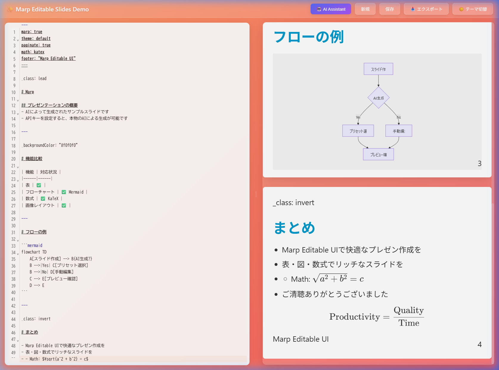

# Marp Editable UI

<div align="center">
  

  ## 🎯 Marpスライド編集・プレビュープラットフォーム

  [](https://nodejs.org/)
  [](https://www.typescriptlang.org/)
  [](https://reactjs.org/)
  [](https://vitejs.dev/)
  [](https://expressjs.com/)
  [](https://www.docker.com/)

  [](https://opensource.org/licenses/MIT)
  [](http://makeapullrequest.com)
</div>

> **Fork情報**: このリポジトリは [Sunwood-ai-labs/marp-editable-ui](https://github.com/Sunwood-ai-labs/marp-editable-ui) のフォークです。
> オリジナルプロジェクトへの敬意を持って、独自機能を追加・改善しています。

## 🌟 特徴

- 📝 リアルタイムマークダウン編集
- 🔄 インスタントプレビュー
- 📊 高度なコンテンツ表示 (テーブル, Mermaid図解, KaTeX数式) 
- 📤 複数形式でのエクスポート（PDF, PPTX, PNG, HTML）
- 🤖 AI Assistant によるスライド自動生成・最適化
- 🎨 カスタマイズ可能なテーマ (Default, Gaia, Uncover)
- 🌙 ダーク/ライトモード対応
- 🐳 Docker によるかんたん環境構築

### ✨ このフォークで追加された機能

- 🤖 **AI Assistant の大幅強化** - Google Gemini / OpenAI による高度なスライド支援
  - **構造化データ生成**: プロンプトから表や図、数式を含む整合性の取れたスライドを生成
  - **編集プリセット**: 「ダークモード化」「Gaiaテーマ適用」「表/図/数式の挿入」などのクイック操作に対応
  - **堅牢なフォールバック**: AIのレスポンス形式が崩れても、最適な形でエディタに反映
- 🧜 **Mermaid.js の統合** - `mermaid` コードブロックによるフローチャート、シーケンス図等の動的描画
- 📐 **KaTeX 数式サポート** - 美しい数式（インライン `$..$` / ブロック `$$..$$`）のレンダリング
- 📋 **最適化されたテーブル表示** - スライドで見やすいストライプスタイルのテーブル
- 🐳 **Docker環境の完全サポート** - LibreOffice, Chromium 内蔵により、PPTX/PDF出力をコンテナ内で完結

## 📸 機能デモンストレーション


*AI Assistantによる生成、Gaiaテーマ、数式、Mermaid図解の同時利用例*

## 🛠️ 技術スタック

### フロントエンド
- React 18.3
- TypeScript 5.6
- Vite 6.0
- Mantine UI
- CodeMirror (コードエディタ)
- Socket.IO Client (リアルタイム通信)

### バックエンド
- Node.js 20
- Express 4.18
- Marp CLI / Marpit (スライド変換)
- Socket.IO (WebSocket)
- LibreOffice (PowerPoint変換)

### インフラ
- Docker
- Nginx
- Alpine Linux

## 📦 必要要件

- Node.js 20.x
- npm または yarn
- Docker & Docker Compose
- LibreOffice (PowerPointエクスポート用)

## 🚀 クイックスタート

### Docker を使用する場合

```bash
# リポジトリのクローン
git clone https://github.com/your-username/marp-editable-ui.git
cd marp-editable-ui

# コンテナのビルドと起動
docker-compose up --build
```

### ローカル環境での実行

1. 依存関係のインストール:
```bash
npm run install-all
```

2. 開発サーバーの起動:
```bash
npm run dev
```

3. ブラウザで以下のURLにアクセス:
- フロントエンド: http://localhost:5173
- バックエンドAPI: http://localhost:3001

## 📁 プロジェクト構成

```
marp-editable-ui/
├─ client/                 # フロントエンド
│  ├─ public/             # 静的ファイル
│  ├─ src/
│  │  ├─ components/      # Reactコンポーネント
│  │  │  ├─ Editor/       # マークダウンエディタ
│  │  │  ├─ Header/       # ヘッダーメニュー
│  │  │  └─ Preview/      # スライドプレビュー
│  │  ├─ styles/          # グローバルスタイル
│  │  └─ App.tsx          # メインアプリケーション
│  ├─ Dockerfile          # フロントエンドのDocker設定
│  └─ vite.config.ts      # Vite設定
├─ server/                 # バックエンド
│  ├─ index.js            # Express/Socket.IOサーバー
│  └─ Dockerfile          # バックエンドのDocker設定
└─ docker-compose.yml      # Docker Compose設定
```

## 💫 主な機能

### エディタ機能
- シンタックスハイライト
- 自動インデント
- リアルタイムプレビュー
- 行番号表示
- コードフォールディング

### プレビュー機能
- リアルタイム更新
- スライドのスケーリング
- エラー表示
- カスタムテーマ適用

### エクスポート機能
- PDF出力
- PowerPoint (PPTX) 出力
- PNG画像出力
- HTMLエクスポート

## 🤖 AI Assistant の設定

AI Assistantを利用するには `.env` ファイルにAPIキーを設定してください。

```bash
# Google Gemini を使用する場合（推奨）
GEMINI_API_KEY=your_gemini_api_key
GEMINI_MODEL=gemini-2.0-flash  # または gemini-flash-lite-latest

# OpenAI を使用する場合
LLM_PROVIDER=openai
OPENAI_API_KEY=your_openai_api_key
OPENAI_MODEL=gpt-4o  # 任意のモデル
```

APIキーが設定されていない場合、モックデータが代わりに使用されます。

## 🔧 環境設定

### PowerPointエクスポート用のLibreOfficeセットアップ

#### Windows
1. [Vector（窓の杜）](https://forest.watch.impress.co.jp/library/software/libreoffice/)からLibreOfficeをダウンロード
2. インストーラーを実行
3. デフォルト設定でインストール

#### macOS
```bash
brew install --cask libreoffice
```

#### Linux (Ubuntu/Debian)
```bash
sudo apt-get update
sudo apt-get install libreoffice
```

## 🌐 ネットワーク設定

デフォルトポート:
- フロントエンド: 5173
- バックエンド: 3001
- WebSocket: 3001

環境変数での設定変更が可能です:
```bash
# .env
VITE_API_URL=http://localhost:3001
PORT=3001
SOCKET_PORT=3001
```

## 🔒 セキュリティ考慮事項

- CORS設定済み
- WebSocketセキュリティ対策実装
- Nginxセキュリティヘッダー設定
- ファイルアップロード制限
- サニタイズ処理

## 🤝 コントリビューション

1. このリポジトリをフォーク
2. 新しいブランチを作成 (`git checkout -b feature/amazing-feature`)
3. 変更をコミット (`git commit -m 'Add some amazing feature'`)
4. ブランチにプッシュ (`git push origin feature/amazing-feature`)
5. プルリクエストを作成

## 📄 ライセンス

MIT License - 詳細は [LICENSE](LICENSE) ファイルを参照してください。

## 🙏 クレジット

### オリジナルプロジェクト

- **[Sunwood-ai-labs/marp-editable-ui](https://github.com/Sunwood-ai-labs/marp-editable-ui)** - このフォークのベースとなったオリジナルプロジェクト。素晴らしい基盤を提供していただきありがとうございます。

### 使用技術

- [Marp](https://marp.app/) - Markdownプレゼンテーションエコシステム
- [React](https://reactjs.org/) - UIライブラリ
- [Vite](https://vitejs.dev/) - フロントエンドツール
- [Express](https://expressjs.com/) - Node.jsウェブアプリケーションフレームワーク
- [LangChain](https://js.langchain.com/) - LLM統合フレームワーク
- [Google Gemini](https://ai.google.dev/) / [OpenAI](https://openai.com/) - AI生成エンジン

## 📮 お問い合わせ

質問や提案がありましたら、Issueを作成するかプルリクエストを送信してください。
オリジナルプロジェクトへのフィードバックは [Sunwood-ai-labs/marp-editable-ui](https://github.com/Sunwood-ai-labs/marp-editable-ui) まで。
